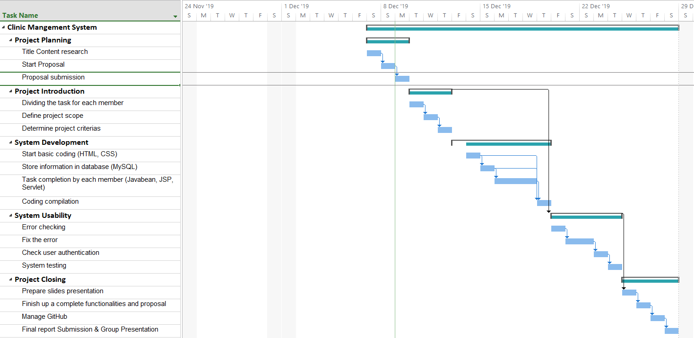

# GROUP PROJECT PROPOSAL  
# CLINIC MANAGEMENT SYSTEM

Members Name  | Matric No
------------- | -------------
Nurul Aqilah binti Zakaria  | 1719406
Nur Hanani binti Ab Hannan  | 1710992
Syazwana Izzati binti Azaddin  | 1713650
Nurul Zafirah binti Shaharuddin  | 1719004

## 1.1 INTRODUCTION

We would like to develop an application regarding clinic management system. This application would make data storing and data retrieval easier for the receptionists. Other than that, we would include processes such as registration of new patients, appointments with the doctors and billing of the treatments. In addition, the records of existing patients would also be stored in the database to provide them a smooth visit to the clinic in the future.

## 1.2 PROBLEM DESCRIPTION
### 1.2.1 Background of the problem

The environment in which we are planning to develop the application is using web application. The target users that will use the system are the receptionists and doctors. Generally, a common problem with the current processes that some clinics are facing is that they use traditional database whereby they keep all the patients’ records in a log book. Whenever the patients visit the clinic to meet the doctor, the clients will wait for a long time for the receptionist to search for their names in order to track the record. This traditional system is also not reliable since they use papers and inks in which it could fade away and the words can no longer be seen. Therefore, in order to improve the system, we came up with a system that could lead to a better management style.

### 1.2.2 Problem Statement

The deficiencies of handling the medical data had bring serious implications towards the user in current practices of medical record audit. The specific problems with the existing system are:

-Longer time taken to search for patients’ records  
-Lots of paper usage  
-Inks on the papers turn out fade  
-Papers can be misplaced without having other alternative  
-No backup to restore data and information
-No security system

Thus, below are the processes that we are considering to automate or enhance through our proposed application:

-Set a usable system for the users to access it quick  
-Simple and interactive interface  
-No paper and ink required  
-Store data and information safely  
-Secured system

## 1.3 PROJECT OBJECTIVE

Our main objective for this project is to ease the receptionists, doctors and nurses to do their work. So we provide this website and try to make it useful and friendly to our users. On our website, we will reduce the number of clicks it takes a client to reach the most elevated traffic page that most of our website clients consistently visit from any point on the site to 2 clicks or less than that. Then, we will also assemble the website to fulfill a standards, that will be completely tried against the criteria.

## 1.4 PROJECT SCOPE
### 1.4.1 Scope

Our scope for this project is strictly for the  clinic management system. This system will help the management of the hospital with the data store and data retrieval as some of the clinics are having problems with keeping the database in the traditional way. This web application are making it easier for the receptionist and the doctors as they can view the date and time of the patients if there are making any appointments, the disease or problem that the patients have or the type of medicine they take. 

### 1.4.2 Targeted User

Firstly, our targeted users are receptionists that coordinate day-to-day activities of doctors, nurses and patients by scheduling new and follow-up appointments, registering new patients and updating records. They will be the ones who do most of the data storing and data retrieval for everyone involved in the clinic. Next, nurses who assist the doctors which involves collecting patient information and perform or aid in medical tests. Lastly, doctors who give the treatment and do the consultation to the patients in the clinic. 

### 1.4.3 Specific Platform

The infrastructure that we need for our project is MySQL and Eclipse. For Eclipse, we need to build for the model, view and controller which consist of JSP pages, Servlet and Javabean. After all the development of the pages is done, the connection of the database which involves MySQL is established so that the database of the patients and doctors are included in the system. This will help the hospital management with the data storing and retrieval of the data so that it will be easier in handling the huge amount of data.

## 1.5 CONSTRAINTS

In any project development, limitations and constraints need to be taken into account to ensure the project’s success at the end. For our project, there are a few limitations that will be faced: 

-Not enough time to develop this application.  
-Lack of skill and knowledge in coding to develop an application.   
-Limited resources because there are many elements that need to be included for a complete clinic management application.

## 1.6 PROJECT STAGES (GANTT CHART)

## 1.7 SIGNIFICANCE OF THE PROJECT

As it has been mentioned, our target users are receptionists, doctors and nurses. We will provide a platform for them to scheduling, registering new patients and updating records. Nurses and receptions will be the one who does the data storing that involved in the clinic. After that, nurses and doctors can easily collect patient information and records for medical use.

## 1.8 SUMMARY

We will develop and provide an application that eases the clinic management. A typical issues with the current procedures that some clinics still use a traditional database which is they keep all the patients’ records in a log book. By using a traditional way will make the receptionist takes a long time to search and trace the patient’s record and the probability to lose the patients’ information is also high when using this traditional method. Doctors and nurses also can easily check the patient's record by using this web application. Therefore, we develop this web application to help them to store the data and information of patients safely. Additionally, we also develop this web application also because to secure the system so that the data that already stored in the system did not lose.

## 1.9 REFERENCES

-Spacey, J. (2018, Jan 04). 21 examples of project objectives. Retrieved from https://simplicable.com/new/project-objectives  
-Cullen, M. (2019, Jun 04). 10 Best Proposal Examples [with critical critiques]. Retrieved from https://www.instructionalsolutions.com/blog/proposal-examples  
-Muholland, B. (2017, July 31) 6 types of project proposals that get approved (and how to write them). Retrieved from https://www.process.st/project-proposal/  
-3 Problems You Can Solve with Clinic Management Software. (2018, October 31). Retrieved from https://thejournalofmhealth.com/3-problems-you-can-solve-with-clinic-management-software/  

