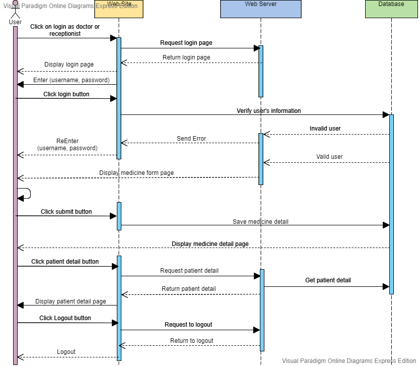
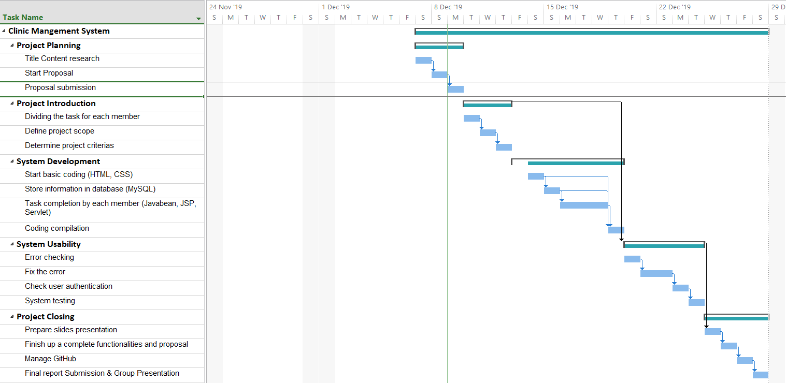

# FINAL REPORT  
# CLINIC MANAGEMENT SYSTEM

Members Name  | Matric No
------------- | -------------
Nurul Aqilah binti Zakaria  | 1719406
Nur Hanani binti Ab Hannan  | 1710992
Syazwana Izzati binti Azaddin  | 1713650
Nurul Zafirah binti Shaharuddin  | 1719004

## 1.1 INTRODUCTION

We had developed an application regarding clinic management system. This application made data storing and data retrieval
easier for the receptionists and doctors. Other than that, we had included processes such as registration of new patients. In addition,
this web application will records all of existing patients' data and it would also be stored in the database to provide them a smooth 
visit to the clinic in the future.

## 1.2 PROBLEM DESCRIPTION
### 1.2.1 Background of the problem

The environment in which we planned is to develop the application is using web application. The target users that will use the system 
are the receptionists and doctors. Generally, a common problem with the current processes that some clinics are facing is that they use 
traditional database whereby they keep all the patients’ records in a log book. Whenever the patients visit the clinic to meet the 
doctor, the clients will wait for a long time for the receptionist to search for their names in order to track the record. This 
traditional system is also not reliable since they use papers and inks in which it could fade away and the words can no longer be seen. 
Therefore, in order to improve the system, we came up with a system that could lead to a better management style.

### 1.2.2 Problem Statement

The deficiencies of handling the medical data had bring serious implications towards the user in current practices of medical record 
audit. The specific problems with the existing system are:

-Longer time taken to search for patients’ records  
-Lots of paper usage  
-Inks on the papers turn out fade  
-Papers can be misplaced without having other alternative  
-No backup to restore data and information  
-No security system  

Thus, below are the processes that we has considered to enhance through our proposed application:

-Set a usable system for the users to access it quick  
-Simple and interactive interface  
-No paper and ink required  
-Store data and information safely  
-Secured system  

## 1.3 PROJECT OBJECTIVE

Our main objective for this project is to ease the receptionists and doctors to do their work. So we provide this web application 
and try to make it useful and friendly to our users. On our web application, we will reduce the number of clicks it takes a client to 
reach the most elevated traffic page that most of our website clients consistently visit from any point on the site to 2 clicks or less 
than that. Then, we will also assemble the website to fulfill a standards, that will be completely tried against the criteria.

## 1.4 PROJECT SCOPE
### 1.4.1 Scope

Our scope for this project is strictly for the  clinic management system. This system will help the management of the hospital with 
the data store and data retrieval as some of the clinics are having problems with keeping the database in the traditional way. This web 
application are making it easier for the receptionist and the doctors as they can view the date and time of the patients if there are 
making any appointments, the disease or problem that the patients have or the type of medicine they take. 

### 1.4.2 Targeted User

Firstly, our targeted users are receptionists that coordinate day-to-day activities of doctors, nurses and patients by registering new 
patients and updating records. They will be the ones who do most of the data storing and data retrieval for everyone involved in the 
clinic. Lastly, doctors who give the treatment and do the consultation to the patients in the clinic. 

### 1.4.3 Specific Platform

The infrastructure that we need for our project is MySQL and Eclipse. For Eclipse, we need to build for the model, view and controller 
which consist of JSP pages, Servlet and Javabean. After all the development of the pages is done, the connection of the database which 
involves MySQL is established so that the database of the patients and doctors are included in the system. This will help the hospital 
management with the data storing and retrieval of the data so that it will be easier in handling the huge amount of data.

## 1.5 CONSTRAINTS

In any project development, limitations and constraints need to be taken into account to ensure the project’s success at the end. For 
our project, there are a few limitations that will be faced: 

-Not enough time to develop this application.  
-Lack of skill and knowledge in coding to develop an application.   
-Limited resources because there are many elements that need to be included for a complete clinic management application.  

## 1.6 SEQUENCE DIAGRAM

## 1.7 GANTT CHART

## 1.8 SIGNIFICANCE OF THE PROJECT

As it has been mentioned, our target users are receptionists and doctors. We have provided a platform for them to register new 
patients and update new records. Receptionists will be the one who does the data storing that involved in the clinic. After that, doctors can easily collect patients' informations and records for medical use.

## 1.9 SUMMARY

We has developed an application that we believe it will ease the clinic management. A typical issue with the current procedures that some clinics still use is a traditional database which is they keep all the patients’ records in a log book. By using a traditional way, it will make the receptionist takes a longer time to search and trace the patient’s record and the probability to lose the patients’ information is also high when using this traditional method. Doctors also can easily check the patient's record by using this web application. Therefore, we develop this web application to help them to store the data and information of patients safely. Additionally, we also develop this web application to secure the system so that the data that already stored in the system will not lose.

## 2.0 REFERENCES

-Spacey, J. (2018, Jan 04). 21 examples of project objectives. Retrieved from https://simplicable.com/new/project-objectives  
-Cullen, M. (2019, Jun 04). 10 Best Proposal Examples [with critical critiques]. Retrieved from https://www.instructionalsolutions.com/blog/proposal-examples  
-Muholland, B. (2017, July 31) 6 types of project proposals that get approved (and how to write them). Retrieved from https://www.process.st/project-proposal/  
-3 Problems You Can Solve with Clinic Management Software. (2018, October 31). Retrieved from https://thejournalofmhealth.com/3-problems-you-can-solve-with-clinic-management-software/  
-Ramesh, F. (2018). JDBC Tutorial. Retrieved from javaguides.net/p/jdbc-tutorial.html

